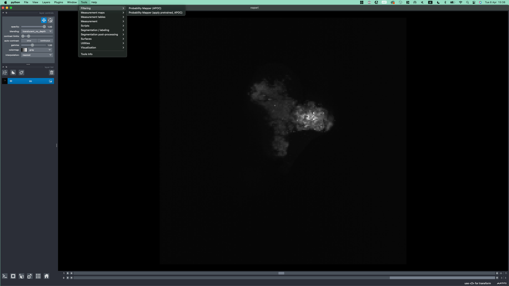
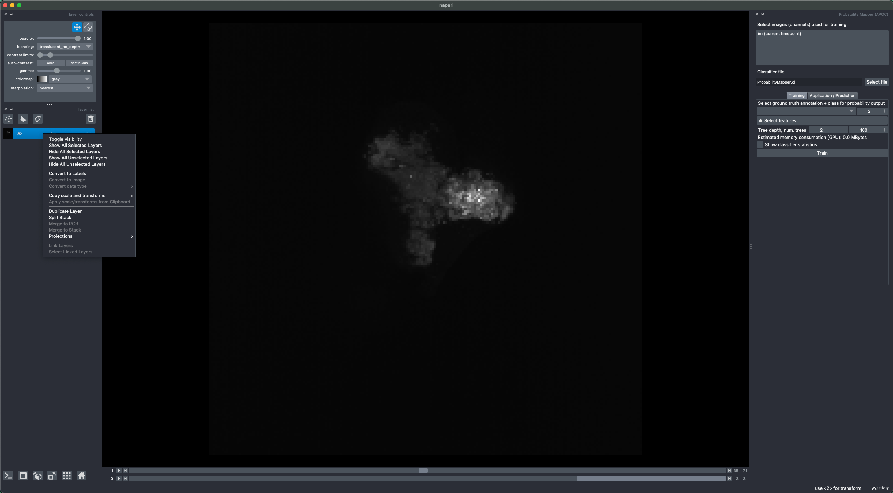
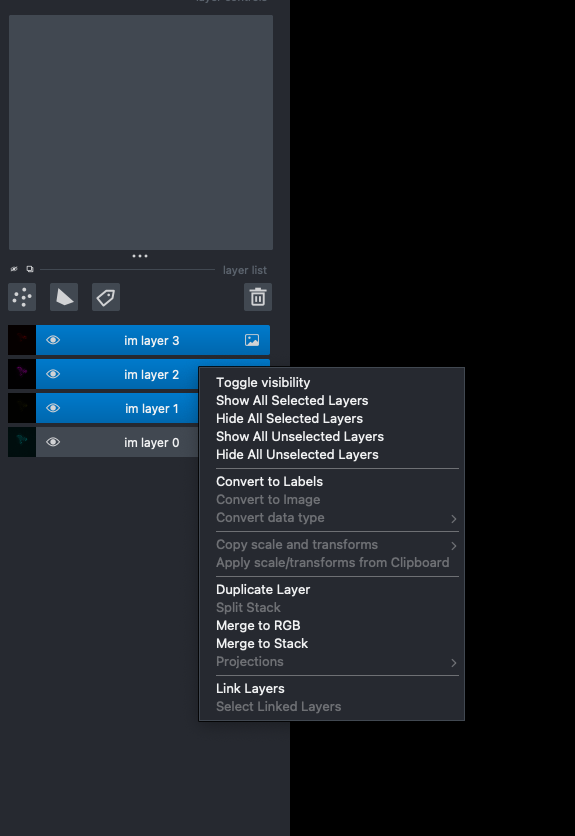
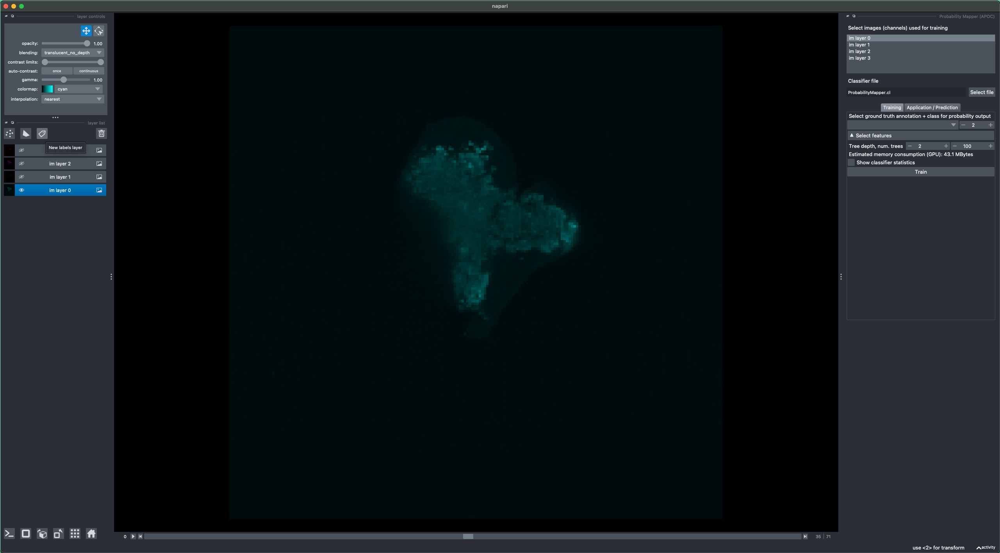
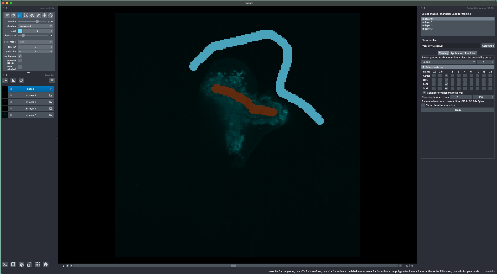
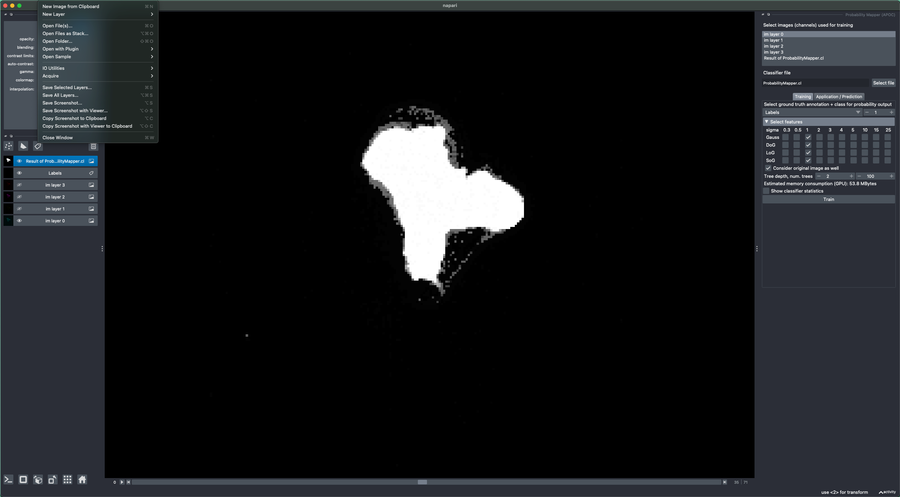

# 🧪 surface-sampling

A repository for surface sampling.

## 📦 Installation

To get started, clone the repository and set up the environment using Conda.

### 1. Clone the repository

```bash
git clone https://github.com/alvillars/surface-sampling.git
cd surface-sampling
```

### 2. Setup

To create the environment:

```bash
conda env create -f environment.yml
conda activate your-env-name
```


### 3. 🔧 Setup

To get started run the Opening_downscaled_im.py file, select the file of interest to segment and open it with napari

Once open go to tools > Filtering > ProbabilityMapper (APOC)



Split your stack to keep only the channel to segment 



For ease of manipulation, toggle the visibility of the other channels




Select the layer 



Open a Labels Layer and annotate your image 




Select your annotations on the right and the class to select in the probability ouput
In the drop down menu select your image to be considered as well and then click train 

Once this is done, save the prediction. 
For this select your image go to File > Save Selected Layer


